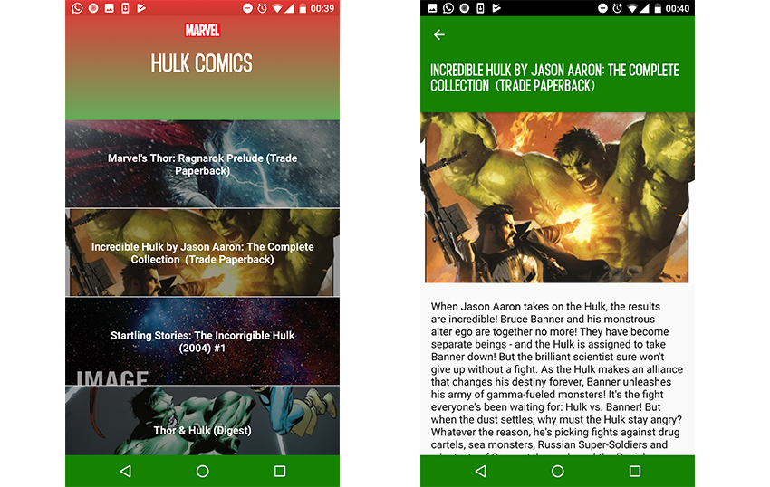

# Android Test for Candidates (Marvel API)

This is my resolution of the tech exercise for Android Developer in Wallapop.
The project is based on Clean Architecture and MVP.

Libraries used on the project
------------------------------------
* [AppCompat, CardView, RecyclerView & DesignLibrary][2]
* [RxJava & RxAndroid][3]
* [Dagger 2][4]
* [Junit][5]
* [Mockito][6]
* [Robolectric][8]
* [Hamcrest][9]

[2]: http://developer.android.com/intl/es/tools/support-library/index.html
[3]: https://github.com/ReactiveX/RxAndroid
[4]: https://github.com/google/dagger
[5]: http://developer.android.com/intl/es/reference/junit/framework/package-summary.html
[6]: http://mockito.org/
[8]: http://robolectric.org/
[9]: http://hamcrest.org/

Developed By
------------

* Jaume Colom Ferrer - <jaumecolomferrer@gmail.com>

* [Linkedin](https://www.linkedin.com/in/jaumecolom/)

